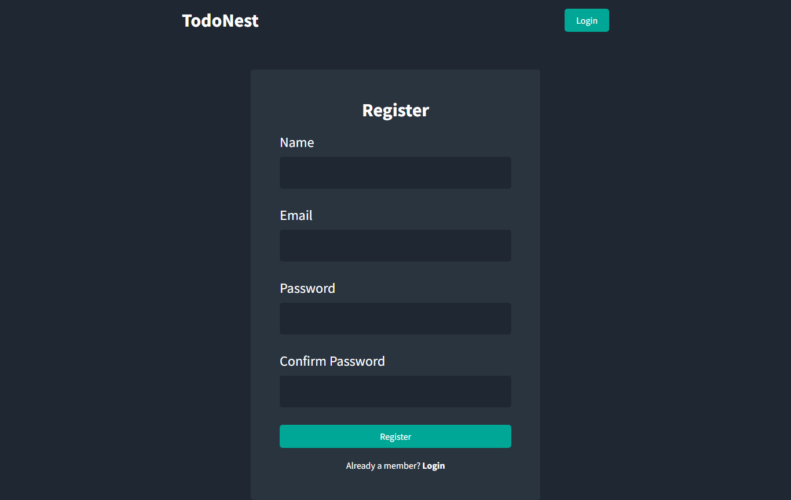
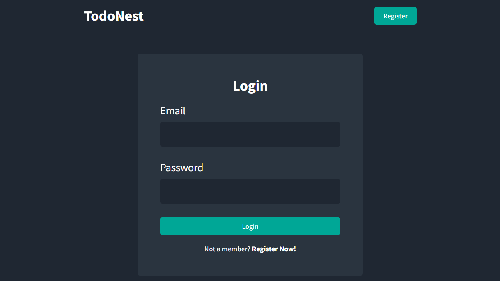
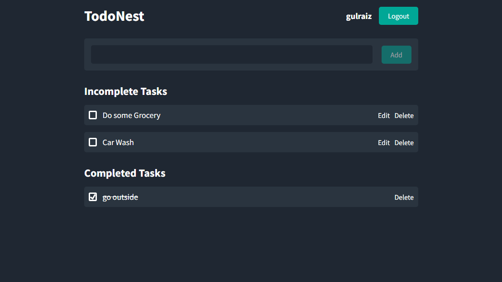

<div align="center">
  <h1>TodoNest</h1>
  <h3>A MERN Stack based Todo List App with CRUD Operations, User Authentication & Authorization</h3>
</div>
<h2> 🖥️ Demo </h2>
<div align="center">
  
  
  
</div>

## ⚙️ Functionalities

-   [x] User Registration & Login
-   [x] Add New Task
-   [x] Update Existing Task
-   [x] Delete Task
-   [x] Mark Task as Complete/Incomplete

## ⬇️ Installation steps

Copy & Paste the following commands in your terminal:

```
git clone https://github.com/gulraiznoorbari/TodoNest.git
cd TodoNest
npm install-client
npm run dev
```

## 👨‍💻 Author

You can get in touch with me on my LinkedIn Profile:

#### Gulraiz Noor Bari

[](https://www.linkedin.com/in/gulraiznoorbari)
[](https://twitter.com/gulraiznoorbari)

You can also follow my GitHub Profile to stay updated about my latest projects: [](https://github.com/gulraiznoorbari)

If you liked the repo then kindly support it by giving it a star ⭐!

## Contributions Welcome

[](#)

If you find any bug in the code or have any improvements in mind then feel free to generate a pull request.
